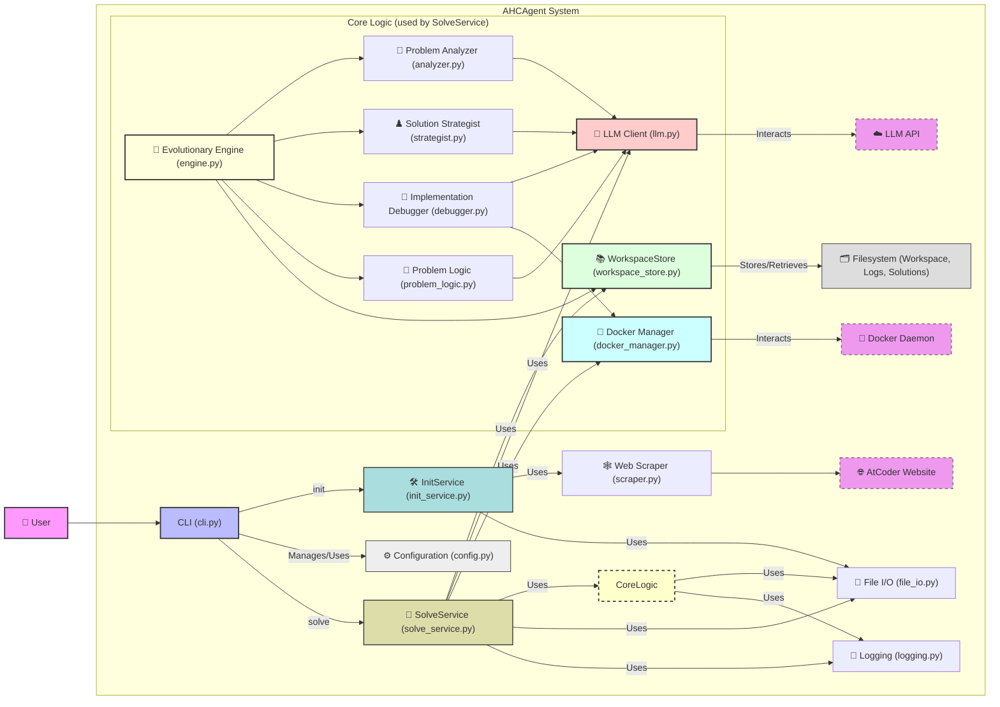

# AHCAgent アーキテクチャ設計

## 1. システムアーキテクチャ




## 2. CLI コマンド設計

```
ahc-agent [OPTIONS] COMMAND [ARGS]...
```

### グローバルオプション

-   `--verbose` (`-v`): 詳細なログ（デバッグレベル）を出力します。
-   `--quiet` (`-q`): 最小限のログ（エラーレベルのみ）を出力します。

### コマンド

1.  **`init`**

    ```
    ahc-agent init [OPTIONS] CONTEST_ID
    ```

    -   指定された `CONTEST_ID` の新しい AHC プロジェクトを初期化します。
    -   プロジェクトディレクトリ（デフォルトでは `CONTEST_ID` 名、`--workspace` で指定可）と、その中に設定ファイル (`config.yaml`) を作成します。
    -   設定ファイルには `contest_id` が記録されます。
    -   指定された `CONTEST_ID` の問題文のスクレイピングを試み、`problem.md` として保存し、公式ツール (tools.zip) があればダウンロード・展開します。
    -   オプション:
        -   `CONTEST_ID`: (必須) AtCoder Heuristic Contest の ID (例: `ahc001`)。
        -   `--workspace PATH` (`-w`): プロジェクトを作成するディレクトリを指定します。指定がない場合はカレントディレクトリに `CONTEST_ID` 名のディレクトリが作成されます。

2.  **`solve`**

    ```
    ahc-agent solve [OPTIONS] WORKSPACE
    ```

    -   指定されたワークスペースディレクトリ (`WORKSPACE`) 内の問題記述と設定に基づいて問題を解きます。
    -   **ワークスペースディレクトリには `problem.md`（問題記述ファイル）と `config.yaml`（設定ファイル）が含まれている必要があります。**
    -   問題分析、戦略立案、解の進化、評価のプロセスを実行します。
    -   オプション:
        -   `WORKSPACE`: (必須) ワークスペースディレクトリのパス。

        -   `--interactive` (`-i`): 対話モードで問題解決プロセスを進めます。


## 3. 設定管理

### 設定ファイル

`<WORKSPACE>/config.yaml`の設定を書き換えてください。

ワークスペース設定ファイル:
  * 各プロジェクト（ワークスペース）固有の設定ファイルです。
  * `ahc-agent init` コマンド実行時に、コンテストIDなどの基本的な設定を含む `config.yaml` がワークスペース内に**デフォルト値で作成されます。**
  * **ユーザーはこのワークスペース内の `config.yaml` を直接編集して、** LLMのモデル、Dockerイメージ、その他のプロジェクト固有のパラメータをカスタマイズできます。
  * このファイルに記述された設定が最優先されます。


## 4. Docker 統合

`ahc_agent.utils.docker_manager.DockerManager` クラスが Docker 操作を担当します。`solve` コマンド実行時、C++コードのコンパイルと実行に利用されます。

### Docker コンテナ管理

1.  **コマンド実行**:
    -   `docker run --rm -v <host_work_dir>:<mount_path> -w <mount_path> <image> /bin/bash -c "<command>"` の形式で汎用コマンドを実行します。
    -   ホストの作業ディレクトリがコンテナの `/workspace` (デフォルト) にマウントされます。
2.  **C++コードのコンパイルと実行**:
    -   `compile_cpp`: 指定された C++ソースファイルをコンテナ内でコンパイルします。コンパイラやフラグは設定に基づきます (`docker.cpp_compiler`, `docker.cpp_flags`)。
    -   `run_cpp` (現在は `run_executable` という名前で `ImplementationDebugger` 内で使用): コンパイルされた実行可能ファイルをコンテナ内で実行し、標準入出力を扱います。実行時間制限も適用されます。`ImplementationDebugger` は、この機能を `compile_solution` と `run_test_case` に分割し、コードを一度だけコンパイルしてから多数のテストケースで効率的に評価する「compile-once, run-many」モデルを実装しています。

### Dockerfile テンプレートの想定

ユーザーがカスタムイメージを利用する場合の Dockerfile の例として以下のようなものが考えられます (C++開発環境を想定):

```dockerfile
FROM mcr.microsoft.com/devcontainers/rust:1-1-bullseye
# AtCoderのVisualizerがRustで書かれているため、Rust開発環境をベースイメージとしています
# このベースイメージには既に g++, cmake, make, python3, python3-pip などが含まれていることが多い

# 必要に応じて追加のパッケージをインストール
# RUN apt-get update && apt-get install -y \
#     my-other-tool \
#     && rm -rf /var/lib/apt/lists/*

# 作業ディレクトリの設定 (DockerManagerのmount_pathと合わせる)
WORKDIR /workspace
```

## 5. 対話モード (`ahc-agent solve --interactive`)

`SolveService` 内の `run_interactive_session` メソッドによって対話的な問題解決プロセスが提供されます。

### 対話フローの例

1.  **初期化**: セッション情報、問題の概要表示。
2.  **コマンド入力**: ユーザーが次の操作を選択。
    -   `analyze`: 問題分析 (`ProblemAnalyzer` を使用)。結果の概要表示。
    -   `strategy`: 解法戦略の立案 (`SolutionStrategist` を使用)。戦略の概要表示。
    -   `testcases`: テストケース生成 (`ProblemLogic` を使用)。スコア計算機も準備。
    -   `initial`: 初期解生成 (`ProblemLogic` を使用)。
    -   `evolve`: 進化的探索の実行 (`EvolutionaryEngine` を使用)。パラメータは対話的に設定可能。
    -   `status`: 現在の各ステップの完了状態や最良スコアなどを表示。
    -   `help`: コマンド一覧を表示。
    -   `exit`: 対話モードを終了。
3.  各コマンド実行後、結果の概要が表示され、再度コマンド入力状態に戻ります。
