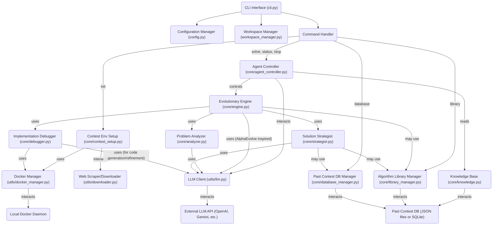

# AHCAgent CLI デザインドキュメント

**バージョン:** 1.0
**最終更新日:** 2025-05-23
**ステータス:** 完成

## 目次
1.  はじめに
    1.1. プロジェクトの目的
    1.2. 背景
    1.3. 解決する課題
2.  対象読者
3.  プロダクトの目標
    3.1. 機能目標
    3.2. 非機能目標
4.  スコープ (対象範囲)
    4.1. 対象とする機能 (In Scope)
    4.2. 対象としない機能 (Out of Scope)
5.  主要機能とユースケース
    5.1. ユースケース1: 新しいAHCコンテストへの参加準備と初期解探索
    5.2. ユースケース2: エージェントの進捗確認と停止
    5.3. ユースケース3: 設定変更と実験の再開
    5.4. ユースケース4: バッチ実験によるパラメータチューニング
    5.5. ユースケース5: 典型アルゴリズムの利用と過去解法の参照
6.  アーキテクチャ
    6.1. 全体構成図
    6.2. 主要コンポーネント詳細
    6.3. データフロー
7.  UI/UX (CLI)
    7.1. コマンド体系
    7.2. 対話モードの主要なやり取り
    7.3. 出力とログ
8.  データモデル
    8.1. 設定ファイル
    8.2. 問題分析結果
    8.3. 個体 (Solution Candidate)
    8.4. セッション情報
    8.5. 典型アルゴリズム/ライブラリデータ
    8.6. 過去コンペ解法データ
9.  考慮事項
    9.1. セキュリティ
    9.2. パフォーマンス
    9.3. エラーハンドリングとリトライ
    9.4. ロギング
10. 将来の展望 (マイルストーン外)
11. 用語集
12. 開発計画
    12.1. 開発フェーズとマイルストーン
    12.2. チーム体制と役割分担 (仮)
    12.3. 開発ツールと環境
13. テスト計画
    13.1. テスト戦略
    13.2. テストの種類と対象
    13.3. モジュール別テスト項目概要
    13.4. テスト環境
    13.5. テスト自動化

## 1. はじめに

### 1.1. プロジェクトの目的
AtCoder Heuristic Contest (AHC) の問題解決プロセスを自動化・支援するためのスタンドアロンCLIツールを提供する。LLMを活用した高度な問題分析、戦略立案、DeepMindのAlphaEvolveにインスパイアされた進化的アルゴリズムによる解探索、C++コード生成・実行・デバッグまでを一貫してサポートする。さらに、典型アルゴリズムの提供や過去コンペの解法データベースを活用することで、競技プログラマーの生産性向上と効率的な解法探索に貢献する。

### 1.2. 背景
AHCのようなヒューリスティック型コンテストでは、問題の特性把握、多様な解法の試行、パラメータ調整といった多岐にわたる作業が求められ、多くの時間と労力を要する。特に、LLMの能力を最大限に活用しつつ、ローカル環境で完結し、かつ再現性の高い開発・実験サイクルを効率的に回すためのツールが不足している。AlphaEvolveのようなアプローチは、LLMをコーディングエージェントとして活用し、アルゴリズム設計自体を進化させる可能性を示しており、本ツールはこの思想をAHCの文脈で実現することを目指す。また、過去の知見や汎用的なアルゴリズム部品の再利用を促進することで、車輪の再発明を防ぎ、より高度な戦略に注力できる環境を提供する。

### 1.3. 解決する課題
* AHC問題解決における定型的な作業（問題分析、コードの雛形作成、コンパイル・実行、簡単な実験管理など）の自動化。
* LLMを用いた問題分析・戦略提案による、解法アプローチの多様化と質の向上。
* AlphaEvolveに着想を得た、LLMによるコード生成・変異・交叉を伴う進化的アルゴリズムによる解探索プロセスの自動化と効率化。
* Dockerを用いた再現可能かつ分離された実行環境の提供。
* ローカル環境での開発・実験サイクルの高速化。
* コンテスト開始時の環境構築の自動化（問題文、テストケース、ビジュアライザ等の取得とセットアップ）。
* 典型的なアルゴリズムやデータ構造のライブラリへの容易なアクセスと利用。
* 過去のコンテスト問題とそれに対する有望な解法アプローチのデータベース化と検索・参照。

## 2. 対象読者

このドキュメントは、以下の関係者を対象としています。
* 開発者
* プロジェクト貢献者
* (将来的に) `AHCAgent CLI` のパワーユーザー

## 3. プロダクトの目標

### 3.1. 機能目標
* **問題分析**: LLMを使用してAHCの問題文を解析し、制約、入出力形式、スコアリングルールなどを構造化して抽出できる。
* **戦略提案**: 分析結果に基づき、LLMが複数の解法戦略やアルゴリズムのアイデアを提案できる。必要に応じて、内蔵の典型アルゴリズムライブラリや過去の解法データベースを参照し、提案に含めることができる。
* **コード生成**: 選択された戦略に基づき、C++の基本的な実装コード（テンプレート利用）を生成できる。典型アルゴリズムライブラリのコード片を組み込むことも可能とする。
* **進化的解探索 (AlphaEvolve風)**: 生成されたコードをベースに、LLMを主要なオペレータ (変異、交叉、新規生成など) として活用するAlphaEvolveに類似した進化的アルゴリズムを実行し、解を改善できる。これには、LLMによるコードの理解、改善提案、バグ修正の試みも含む。
* **ローカル実行・評価**: Dockerコンテナ内でC++コードを安全にコンパイル・実行し、ローカルテスター（または提供されるサンプルケース）で評価できる。
* **実験管理**: 実行した実験のパラメータ、生成されたコード、スコアなどを記録・管理できる。
* **CLI操作**: 上記機能を直感的なコマンドラインインターフェースから操作できる。
    * **プロジェクト初期化 (`init {competition_id}`)**: 指定されたコンペティションIDに基づき、ワークスペース作成、ディレクトリ初期化、Docker開発環境セットアップ、実験記録ファイル初期化、問題文ダウンロード、テストケース生成ツールダウンロード、テストケース生成、ビジュアライザセットアップ、テスト実行コマンド作成までを自動で行う。
    * **問題解決プロセスの実行 (`solve`)**: エージェントがバックグラウンドで解探索を開始。ユーザーは実行中に自然言語で追加の指示やヒントを与えることが可能。
    * **実行状況の確認 (`status`)**: 現在の進捗、実験結果の成否、使用したLLMトークン数や推定料金などを分かりやすく表示。
    * **プロセスの停止 (`stop`)**: 実行中のエージェントを安全に停止。
    * **設定管理 (`config`)**: LLM関連設定（モデル、APIキー等）、進化計算のハイパーパラメータなどを設定・確認。
    * **ライブラリ/DB操作 (`library`, `database`)**: 典型アルゴリズムライブラリの参照や、過去コンペ解法DBの検索を行うコマンド。
* **対話モード**: ユーザーがステップごとに確認・介入しながら問題解決プロセスを進められる。
* **バッチ処理モード**: 複数の問題や設定で自動的に実験を実行できる。
* **典型アルゴリズム・ライブラリ**: 頻出するアルゴリズム（焼きなまし法、ビームサーチ、ダイクストラ法など）やデータ構造（Union-Find木など）のC++実装を提供し、エージェントが容易に利用できるようにする。
* **過去コンペ解法データベース**: 過去のAHC問題の概要、特徴、上位解法で用いられたアプローチやアルゴリズムの情報をデータベース化し、キーワードや問題特性で検索・参照できるようにする。

### 3.2. 非機能目標
* **ユーザビリティ**: CLIのコマンドやオプションは直感的で理解しやすいものにする。
* **パフォーマンス**: 問題分析やコード生成、小規模な実験実行は妥当な時間内に完了する。
* **拡張性**: 新しいLLMモデルやアルゴリズム、プログラミング言語（将来的には）への対応を考慮した設計にする。典型アルゴリズムライブラリや解法DBへの追加・更新も容易であること。
* **再現性**: Dockerコンテナの利用により、異なる環境でも実験結果の再現性を担保する。
* **保守性**: モジュール化されたクリーンなコードベースを維持する。

## 4. スコープ (対象範囲)

### 4.1. 対象とする機能 (In Scope)
* 上記「3.1. 機能目標」に記載されたすべての機能。
* AtCoder Heuristic Contest の問題形式への特化。
* `init` コマンドによる、コンテスト環境の自動セットアップ機能（問題文、公式ツール類、テストケースの取得と配置）。
* LLMとして `LiteLLM` がサポートするモデルへの対応 (初期はOpenAI GPTシリーズやGeminiシリーズを主眼)。
* 解法コードの主言語としてC++をサポート。
* ローカルファイルシステムへの実験結果の保存。
* AlphaEvolveの主要なアイデア（LLMによるコード進化、多様性維持のためのプロンプトエンジニアリングなど）の導入。
* 基本的な典型アルゴリズム・データ構造のC++ライブラリの提供と、それらをエージェントが参照・利用する仕組み。
* 過去のAHC問題のメタデータと解法パターンの小規模なデータベースの構築と、CLIからの簡易的な検索・参照機能。

### 4.2. 対象としない機能 (Out of Scope)
* GUIインターフェースの提供。
* クラウドベースの大規模分散実行環境の構築・管理。
* 複数ユーザーによる同時利用・共有機能。
* AHC以外のコンテスト形式への汎用的な対応。
* 複雑な数式処理や高度な数学的解析機能の組み込み。
* `submit` コマンドによる自動提出機能（生成されたファイル群をワークスペースに整理して配置するまでとする）。
* LLMのファインチューニング機能。
* AlphaEvolve論文で言及されているような発見的アルゴリズムの完全な自動設計（初期段階では、より具体的なヒューリスティック問題解決の文脈でのコード改善に注力）。
* `init` コマンドにおける、非公式なツールや複雑な依存関係を持つツールの自動セットアップ。
* 網羅的なアルゴリズムライブラリの構築（初期は主要なものに限定）。
* 過去解法DBの自動更新やユーザー投稿機能（初期は手動でのデータ整備を想定）。

## 5. 主要機能とユースケース

### 5.1. ユースケース1: 新しいAHCコンテストへの参加準備と初期解探索
1.  ユーザーはコンテストページでコンペティションID（例: `ahc030`）を確認する。
2.  ユーザーはターミナルで `ahc-agent init ahc030` を実行する。
    * システムは `~/ahc_workspace/ahc030/` のようなワークスペースディレクトリを作成する。
    * システムは公式ページ等から問題文、テストケースジェネレータ、ビジュアライザ等をダウンロードし、ワークスペース内に適切に配置・セットアップする。
    * システムは基本的なテスト実行スクリプトやコマンドエイリアスを生成する。
    * システムはDocker開発環境（Dockerfile、docker-compose.ymlなど）をセットアップする。
    * システムは実験記録用のファイルを初期化する。
3.  ユーザーは `cd ~/ahc_workspace/ahc030` でワークスペースに移動する。
4.  ユーザーはダウンロードされた問題文を確認し、必要であれば `ahc-agent config` でLLMのモデルや進化計算のパラメータを調整する。
5.  ユーザーは `ahc-agent solve` を実行する。
    * エージェントはバックグラウンドで問題分析、戦略立案、初期コード生成、そしてAlphaEvolve風の進化プロセスを開始する。
    * ユーザーは別のターミナルから `ahc-agent status` で進捗を確認したり、必要に応じて `ahc-agent solve --interactive` （または実行中のプロセスへの指示送信機能）で「もう少し探索的なアプローチを試して」といった自然言語での指示を追加する。

### 5.2. ユースケース2: エージェントの進捗確認と停止
1.  ユーザーは `ahc-agent status` を実行する。
    * システムは現在の世代、ベストスコア、実行中のタスク、試行したアプローチの概要、使用トークン数、推定料金などを整形して表示する。
    * （将来的には）簡易的なテキストベースのダッシュボードや、HTMLレポートの生成も考えられる。
2.  ユーザーは期待する成果が得られた、あるいは時間切れが近いなどの理由で `ahc-agent stop` を実行する。
    * システムは実行中の進化プロセスを安全に中断し、現在の状態を保存する。

### 5.3. ユースケース3: 設定変更と実験の再開
1.  ユーザーは `ahc-agent config llm.model gpt-4-turbo` や `ahc-agent config evolution.population_size 20` のように設定を変更する。
2.  ユーザーは `ahc-agent solve --session-id <previous_session_or_new>` で、新しい設定に基づき解探索を再開または新規開始する。

### 5.4. ユースケース4: バッチ実験によるパラメータチューニング
1.  ユーザーはバッチ設定ファイルに、試したいLLMモデルのリスト、`population_size` の範囲などを記述する。
2.  ユーザーは `ahc-agent batch <batch_config_file>` を実行する。
3.  システムは定義された組み合わせで複数の `solve` プロセスを（可能なら並列で）実行し、各実験の結果を体系的に保存する。

### 5.5. ユースケース5: 典型アルゴリズムの利用と過去解法の参照
1.  ユーザーは `ahc-agent solve` を実行中に、エージェントが特定のアルゴリズム（例: 焼きなまし法）の適用を検討していることを `status` や対話モードで知る。
2.  ユーザーは `ahc-agent library show simulated_annealing` (仮コマンド) で、内蔵されている焼きなまし法のテンプレートや説明を確認する。
3.  エージェントは、戦略立案やコード生成の際に、このライブラリの焼きなまし法の実装を参考にしたり、直接利用したりする。
4.  ユーザーは、新しい問題に取り組む前に `ahc-agent database search --keyword "grid_optimization" --tag "geometry"` (仮コマンド) で、過去の類似問題やそこで有効だった解法アプローチを検索する。
5.  エージェントは、戦略提案の際にこのデータベース情報を参照し、有望なアイデアを提示する。

## 6. アーキテクチャ

### 6.1. 全体構成図


### 6.2. 主要コンポーネント詳細
* **CLI (`cli.py`, `__main__.py`)**: ユーザーからのコマンドを受け付け、対応するハンドラを呼び出す。`click` または `Typer` を使用。
* **Configuration Manager (`config.py`)**: 設定ファイル (YAML) と環境変数から設定を読み込み、アプリケーション全体に提供する。管理対象はLLM APIキー・モデル、Docker設定、進化パラメータ、ハイパーパラメータなど。
* **Workspace Manager (`workspace_manager.py`)**: `init`コマンドでコンテストごとのワークスペース構造を初期化・管理。`solve`コマンド実行時はセッションごとのサブディレクトリを管理。入力ファイル、生成コード、ログ、実験結果などを整理して保存。
* **Command Handler (各コマンドに対応するロジック群)**: 各CLIコマンドの具体的な処理フローを実行し、コアモジュール群を協調させる。
    * `InitCommandHandler`: `ContestEnvSetup`を呼び出し、ワークスペース初期化。
    * `SolveCommandHandler`: `AgentController`を起動し、バックグラウンドで進化プロセスを開始。
    * `StatusCommandHandler`: `AgentController`や`KnowledgeBase`から情報を取得し表示。
    * `StopCommandHandler`: `AgentController`に停止シグナルを送信。
    * `ConfigCommandHandler`: `ConfigurationManager`を介して設定を読み書き。
    * `LibraryCommandHandler`: `AlgorithmLibraryManager` を介してライブラリ情報を表示・検索。
    * `DatabaseCommandHandler`: `PastContestDBManager` を介して過去コンペ情報を検索・表示。
* **Contest Environment Setup (`core/contest_setup.py`)**: `init`コマンドの主要ロジック。指定されたコンペティションIDに基づき、問題文、テストケース生成ツール、ビジュアライザ等をWebから取得 (utils/downloader.py経由) し、ワークスペースにセットアップ。Docker環境やテスト用スクリプトも生成。
* **Agent Controller (`core/agent_controller.py`)**: `solve`コマンドで起動されるメインプロセス。`EvolutionaryEngine`の実行を管理し、ユーザーからの自然言語指示（将来的な機能）を解釈してエンジンに伝達。バックグラウンド実行と状態管理。
* **Problem Analyzer (`core/analyzer.py`)**: LLMを使い問題文から構造化情報を抽出。
* **Solution Strategist (`core/strategist.py`)**: LLMを使い解法戦略を立案。必要に応じて `AlgorithmLibraryManager` や `PastContestDBManager` から情報を取得し、戦略に反映させる。
* **Evolutionary Engine (`core/engine.py`)**: AlphaEvolveの思想に基づき、LLMを主要な進化オペレータとして活用し、解（C++コード）を探索・改善する。コード生成・変異の際に `AlgorithmLibraryManager` のコード片を参照・利用することがある。
* **Implementation Debugger (`core/debugger.py`)**: C++コードの生成支援、コンパイル、実行、デバッグ支援。LLMにエラーメッセージを提示し、修正案を生成させることも含む。
* **Knowledge Base (`core/knowledge.py`)**: 実験結果、生成された有望なコード片、効果的だったプロンプト、LLMの使用状況（トークン数、コスト）などをファイルシステムに保存・検索。
* **LLM Client (`utils/llm.py`)**: `LiteLLM` を介してLLM APIとの通信を抽象化。トークン数カウント機能も持つ。
* **Docker Manager (`utils/docker_manager.py`)**: Dockerコンテナのライフサイクル管理、コード実行環境の提供。
* **Algorithm Library Manager (`core/library_manager.py`)**: 典型アルゴリズム・データ構造のC++実装ライブラリを管理。コード片の提供、メタデータ（説明、使い方、計算量など）の管理を行う。ファイルシステム上の特定のディレクトリに格納されたコードファイルとメタデータファイルを読み込む。
* **Past Contest DB Manager (`core/database_manager.py`)**: 過去のAHC問題のメタデータ、特徴、解法アプローチなどを格納したデータベース（JSONファイル群またはSQLite）を管理。検索インターフェースを提供する。
* **Downloader (`utils/downloader.py`)**: Webページからファイル（問題文、ツール類）をダウンロードするユーティリティ。必要に応じてスクレイピング機能も持つ。

### 6.3. データフロー
#### `init {competition_id}` コマンド実行時
1.  ユーザーが `ahc-agent init ahc030` を実行。
2.  CLIがコマンドを解析し、`InitCommandHandler` を呼び出す。
3.  `WorkspaceManager` が `~/ahc_workspace/ahc030/` ディレクトリ構造を作成。
4.  `ContestEnvSetup` が `ahc030` の情報を基に、`Downloader` を使用してAtCoderの関連ページ等にアクセス。
5.  問題文(PDF/HTML)、サンプルコード、テストケース生成ツール(zip/tar.gz)、ビジュアライザ(zip/jar)などをダウンロード。
6.  ダウンロードしたファイルをワークスペース内の所定の場所 (`problem/`, `tools/tester/`, `tools/visualizer/`など) に展開・配置。
7.  `DockerManager` を使用して、開発用Dockerfileやdocker-compose.ymlを生成。
8.  テスト実行用のシェルスクリプト (`test.sh`) やMakefileを生成。
9.  実験記録用のファイル (`experiments.log` や `results.csv` のヘッダなど) を`KnowledgeBase`経由で初期化。

#### `solve` コマンド実行時
1.  ユーザーがワークスペース内で `ahc-agent solve` を実行。
2.  CLIがコマンドを解析し、`SolveCommandHandler` を呼び出す。
3.  `AgentController` が起動し、セッション用ディレクトリを `WorkspaceManager` に準備させる。
4.  `EvolutionaryEngine` が初期化される。
5.  `EvolutionaryEngine` は `ProblemAnalyzer` を使用して問題ファイルを読み込み、LLMで分析、構造化データを生成。
6.  `EvolutionaryEngine` は `SolutionStrategist` を使用して分析結果に基づき、LLMで戦略を提案（この際、`AlgorithmLibraryManager`や`PastContestDBManager`を参照することがある）。
7.  (対話モードの場合、ユーザーが戦略を選択・調整)
8.  `EvolutionaryEngine` が初期個体群（コード）を生成 (必要なら `ImplementationDebugger` 経由でLLM支援、`AlgorithmLibraryManager`参照あり)。
9.  AlphaEvolve風ループ開始:
    a.  `EvolutionaryEngine` が個体を評価 ( `ImplementationDebugger` を使用し、 `DockerManager` 経由でコードを実行)。スコアは `KnowledgeBase` に記録。
    b.  `EvolutionaryEngine` がLLMを活用して選択、交叉、変異操作を行い、新世代を生成。
    c.  `KnowledgeBase` に進捗やLLM利用状況を記録。
10. 終了条件を満たしたら、`AgentController` が最良解を `WorkspaceManager` を通じて所定の場所に保存。

#### `library show <algorithm_name>` コマンド実行時
1.  ユーザーが `ahc-agent library show dijkstra` を実行。
2.  CLIがコマンドを解析し、`LibraryCommandHandler` を呼び出す。
3.  `LibraryCommandHandler` が `AlgorithmLibraryManager` に `dijkstra` の情報を要求。
4.  `AlgorithmLibraryManager` がファイルシステム上のライブラリファイル群から `dijkstra` のコード片とメタデータを取得。
5.  取得した情報を整形し、CLIを通じてユーザーに表示。

## 7. UI/UX (CLI)

### 7.1. コマンド体系
* `ahc-agent init <COMPETITION_ID>`
    * 例: `ahc-agent init ahc030`
    * オプション:
        * `--workspace-root PATH`: ワークスペースのルートディレクトリ (デフォルト: `~/ahc_workspace`)
* `ahc-agent solve [OPTIONS]` (カレントディレクトリが初期化済みワークスペースであることを想定)
    * オプション:
        * `--session-name NAME`: セッション名 (デフォルトは日時ベースのユニークな名前)
        * `--time-limit SECONDS`: 解探索の総時間制限 (デフォルト: 1800秒)
        * `--max-generations NUM`: 進化の最大世代数 (デフォルト: 30)
        * `--population-size NUM`: 各世代の個体群サイズ (デフォルト: 10)
        * `--interactive`: 対話モードで起動 (ユーザー指示を受け付ける)
        * `--problem-file FILE_PATH`: 問題文ファイルのパス (デフォルトはワークスペース内の `problem/problem.md` など)
* `ahc-agent status [SESSION_NAME_OR_ID] [OPTIONS]`
    * オプション:
        * `--watch`: 継続的にステータスを更新表示 (デフォルトは1回表示)
        * `--all`: 全セッションのサマリを表示
* `ahc-agent stop [SESSION_NAME_OR_ID]`
* `ahc-agent config <KEY> [VALUE]`
    * 例: `ahc-agent config llm.model gpt-4o`
    * 例: `ahc-agent config evolution.temperature 0.5`
    * `VALUE`なしで現在の値を表示。ドット記法でネストした値を指定可能。
* `ahc-agent docker <SUBCOMMAND> [ARGS]` (ワークスペース内でのDocker関連操作)
    * `build`: ワークスペース内のDockerfileを使用して開発用Dockerイメージをビルド。
    * `run`: ビルド済みのDockerコンテナを起動し、インタラクティブシェルに入る。
    * `cleanup`: このワークスペースに関連する不要なコンテナやイメージを削除。
* `ahc-agent library <SUBCOMMAND> [ARGS]`
    * `list`: 利用可能なアルゴリズム/ライブラリの一覧を表示。
    * `show <NAME>`: 指定したアルゴリズム/ライブラリの詳細（説明、コード例、計算量など）を表示。
    * `search <KEYWORD>`: キーワードでアルゴリズム/ライブラリを検索。
* `ahc-agent database <SUBCOMMAND> [ARGS]`
    * `search --problem "Problem Name Fragment" --tag "tag_name" --algorithm "algo_name"`: 条件に合う過去コンペ情報を検索。
    * `show <CONTEST_ID>`: 指定したコンペの詳細情報を表示。

### 7.2. 対話モードの主要なやり取り (`ahc-agent solve --interactive`)
1.  問題分析結果の表示と確認プロンプト。
2.  戦略提案の表示とユーザーによる選択・調整プロンプト。エージェントがライブラリやDBを参照した場合、その情報も提示。
3.  初期コード生成の確認プロンプト。
4.  進化プロセス中の定期的な進捗表示 (世代、ベストスコア、LLMによる改善提案の概要)。
5.  ユーザープロンプト (`> `) が表示され、自然言語で指示入力可能。
    * 例: `> もっと山登り法に近い改善を試してみて`
    * 例: `> 現在のベスト解の弱点はどこだと思う？`
    * 例: `> パラメータXを0.1から0.9の範囲で試して`
    * 例: `> 焼きなまし法の冷却スケジュールを指数関数的に変更して`
    * 例: `> 過去のahc015で使われたビームサーチのアイデアを参考にできないか？`

### 7.3. 出力とログ
* **標準出力**: 主要な情報、進捗、ユーザーへのプロンプト (対話モード時)。`status` コマンドの結果。`library`, `database` コマンドの結果。
* **標準エラー出力**: エラーメッセージ、警告。
* **ログファイル**:
    * セッションログ: `workspace/<COMPETITION_ID>/<SESSION_NAME>/logs/session.log` (DEBUGレベル以上の詳細な実行記録、LLMとの全プロンプト・レスポンス、各オペレーションの所要時間など)
    * 実験結果サマリ (CSV形式): `workspace/<COMPETITION_ID>/results.csv` (セッション名, 開始/終了日時, ベストスコア, 最終世代, 使用主要パラメータ, 総LLMトークン数, 推定LLMコストなどを追記)
* **成果物 (ワークスペース内)**:
    * 問題ファイル: `workspace/<COMPETITION_ID>/problem/` (例: `problem.md`, `input_format.txt`)
    * 公式ツール類: `workspace/<COMPETITION_ID>/tools/tester/`, `workspace/<COMPETITION_ID>/tools/visualizer/`
    * 生成されたC++ファイル群: `workspace/<COMPETITION_ID>/<SESSION_NAME>/solutions/gen<世代番号>_id<個体ID>_score<スコア>.cpp`
    * 各テストケースの標準出力: `workspace/<COMPETITION_ID>/<SESSION_NAME>/outputs/gen<世代番号>_id<個体ID>/<testcase_name>.out`
    * 各テストケースのスコアファイル: `workspace/<COMPETITION_ID>/<SESSION_NAME>/scores/gen<世代番号>_id<個体ID>/<testcase_name>.score` (テスターが出力する場合)
    * セッションごとの最終ベスト解: `workspace/<COMPETITION_ID>/<SESSION_NAME>/best_solution.cpp` (シンボリックリンクまたはコピー)

## 8. データモデル

### 8.1. 設定ファイル (`config.yaml`)
グローバル設定 (`~/.ahc_agent/config.yaml`) とワークスペース設定 (`workspace/<COMPETITION_ID>/ahc_config.yaml`) があり、後者が優先される。
```yaml
# LLM設定
llm:
  provider: "openai"  # 例: "openai", "google", "anthropic"
  model: "gpt-4o"
  api_key: "${OPENAI_API_KEY}" # 環境変数から読み込むことを推奨
  temperature: 0.2 # 生成時のランダム性 (0.0-1.0)
  max_tokens: 4096 # 1回のレスポンスの最大トークン数
  timeout: 120 # APIリクエストのタイムアウト秒数

# Docker設定
docker:
  image: "mcr.microsoft.com/devcontainers/cpp:0-bullseye" # デフォルトのC++開発用イメージ
  mount_path: "/workspace" # コンテナ内のワークスペースマウントポイント
  compilation_timeout: 60 # C++コンパイルのタイムアウト秒数
  execution_timeout: 10 # 1テストケースあたりの実行タイムアウト秒数

# 進化的アルゴリズム設定 (AlphaEvolve風)
evolution:
  max_generations: 30
  population_size: 10
  time_limit_seconds: 7200 # セッション全体の時間制限 (2時間)
  score_plateau_generations: 5 # スコア改善が見られない場合に早期終了する世代数
  # LLMによる進化オペレータに関する詳細パラメータ (例: 変異プロンプトのテンプレートなど)
  mutation_prompts:
    - "以下のC++コードの一部を改善してください: {code_snippet}"
    - "この関数の計算量を削減するアイデアはありますか？コードで示してください: {function_code}"
  crossover_prompts:
    - "2つの解法コードAとBがあります。それぞれの良い点を組み合わせた新しい解法を生成してください。\n解法A:\n{code_A}\n解法B:\n{code_B}"
  # その他、多様性維持のための戦略など

# ワークスペース設定
workspace:
  base_dir: "~/ahc_workspace" # 全てのコンペティションワークスペースの親ディレクトリ
  keep_session_files: true # trueの場合、セッション終了後も生成ファイル群を保持
  max_log_size_mb: 100 # セッションログファイルの最大サイズ

# 典型アルゴリズムライブラリ設定
algorithm_library:
  path: "internal" # "internal" (組み込み) またはカスタムパスを指定

# 過去コンペ解法DB設定
past_contest_db:
  path: "internal" # "internal" (組み込み) またはカスタムパスを指定
```

### 8.2. 問題分析結果 (JSON)
`ProblemAnalyzer` が生成し、`EvolutionaryEngine` や `SolutionStrategist` が利用する。
```json
{
  "title": "Problem Title from AHC030",
  "time_limit_ms": 2000,
  "memory_limit_mb": 1024,
  "problem_statement_summary": "LLMによって要約された問題概要...",
  "constraints": {
    "N": { "min": 1, "max": 100, "type": "integer", "description": "点の数" },
    "M": { "min": 1, "max": 1000, "type": "integer", "description": "辺の数" },
    "K": { "min": 0, "max": "N", "type": "integer", "description": "選択する点の最大数"}
  },
  "input_format_description": "1行目にNとM。\n2行目からM行に渡り、辺の情報 u_i, v_i, w_i...",
  "input_variables": [
    {"name": "N", "type": "int"},
    {"name": "M", "type": "int"},
    {"name": "edges", "type": "array_of_objects", "count": "M", "object_schema": {"u": "int", "v": "int", "w": "int"}}
  ],
  "output_format_description": "1行目に選択した点の数K。\n2行目からK行に渡り、選択した点のインデックス...",
  "output_variables": [
    {"name": "K_selected", "type": "int"},
    {"name": "selected_indices", "type": "array_of_int", "count": "K_selected"}
  ],
  "scoring_rules": {
    "description": "スコアは高いほど良い。無効な出力の場合は0点。相対スコアの場合はその旨も記載。",
    "formula_example": "Score = (sum_of_selected_values - penalty_for_invalid_constraints) * 10^6 / MAX_POSSIBLE_SCORE"
  },
  "problem_type_tags": ["optimization", "graph_theory", "combinatorial_search", "geometry"],
  "extracted_keywords": ["グリッド", "最短経路", "クラスタリング", "割り当て問題"],
  "raw_problem_text_path": "workspace/ahc030/problem/problem.md"
}
```

### 8.3. 個体 (Solution Candidate)
`EvolutionaryEngine` が管理する各解候補。
```json
{
  "id": "gen03_ind07_timestamp",
  "generation": 3,
  "parent_ids": ["gen02_ind02", "gen02_ind05"],
  "creation_method": "crossover_llm",
  "llm_prompt_summary": "コードAの高速化とコードBのロバスト性を組み合わせるよう指示",
  "source_code_path": "workspace/ahc030/session_xyz/solutions/gen03_id07_score12345.cpp",
  "parameters_used": {
    "temperature": 0.3,
    "specific_mutation_type": "loop_unrolling"
  },
  "compilation_status": "success",
  "compilation_log_path": "workspace/ahc030/session_xyz/logs/compile_gen03_id07.log",
  "evaluation_scores": {
    "seed0000.txt": 12345,
    "seed0001.txt": 13000
  },
  "average_score": 12672.5,
  "total_score": 25345,
  "execution_time_avg_ms": 150.5,
  "evaluation_status": "completed"
}
```

### 8.4. セッション情報
`AgentController` が管理し、`KnowledgeBase` に記録される。
```json
{
  "session_id": "session_xyz_timestamp",
  "competition_id": "ahc030",
  "start_time": "2025-05-23T10:00:00Z",
  "end_time": "2025-05-23T12:00:00Z",
  "status": "completed",
  "problem_file_path": "workspace/ahc030/problem/problem.md",
  "configuration_snapshot": { },
  "current_generation": 30,
  "best_score_history": [
    {"generation": 0, "score": 5000, "individual_id": "gen00_ind01"},
    {"generation": 5, "score": 8000, "individual_id": "gen05_ind03"},
    {"generation": 25, "score": 12672.5, "individual_id": "gen25_ind07"}
  ],
  "final_best_individual_id": "gen25_ind07",
  "total_llm_tokens_used": {
    "prompt_tokens": 1500000,
    "completion_tokens": 500000,
    "total_tokens": 2000000
  },
  "estimated_llm_cost_usd": 3.50,
  "error_message": null
}
```

### 8.5. 典型アルゴリズム/ライブラリデータ (例: `library/dijkstra.cpp`, `library/dijkstra.meta.json`)
* **`dijkstra.cpp`**: ダイクストラ法のC++実装コード。ヘッダガードやnamespaceで適切に分離。
* **`dijkstra.meta.json`**:
    ```json
    {
      "name": "Dijkstra's Algorithm",
      "filename": "dijkstra.cpp",
      "description": "Finds the shortest paths from a single source vertex to all other vertices in a non-negatively weighted graph.",
      "usage_example": "Graph g(N); /* ... build graph ... */ vector<long long> dist = dijkstra(g, start_node);",
      "function_signatures": [
        "std::vector<long long> dijkstra(const Graph& graph, int start_node)"
      ],
      "template_parameters": ["typename CostType = long long"],
      "time_complexity": "O(E log V) or O(V^2) depending on implementation (typically E log V with priority queue)",
      "space_complexity": "O(V + E)",
      "tags": ["graph", "shortest_path", "weighted_graph"],
      "dependencies": ["vector", "priority_queue", "<utility> for pair"],
      "notes": "Edge weights must be non-negative."
    }
    ```

### 8.6. 過去コンペ解法データ (例: `database/contests.db` - SQLite, または `database/ahc001.json`, `database/ahc002.json` など)
SQLiteの場合のスキーマ例:
* `contests` テーブル: `contest_id (TEXT PK)`, `title (TEXT)`, `date (TEXT)`, `problem_url (TEXT)`, `problem_summary (TEXT)`
* `contest_tags` テーブル: `contest_id (TEXT FK)`, `tag (TEXT)`
* `solution_approaches` テーブル: `solution_id (INTEGER PK)`, `contest_id (TEXT FK)`, `rank_range (TEXT)`, `algorithms_used (TEXT)`, `key_ideas (TEXT)`, `reference_url (TEXT)`

JSONファイルの場合の例 (`database/ahc001.json`):
```json
{
  "contest_id": "ahc001",
  "title": "Advertisement Optimization",
  "date": "2021-03-06",
  "problem_url": "https://atcoder.jp/contests/ahc001/tasks/ahc001_a",
  "problem_summary": "N個の広告枠に広告を配置し、クリック数を最大化する。各広告には期待クリック数とサイズがあり、広告枠のサイズ制約を満たす必要がある。",
  "tags": ["optimization", "simulated_annealing", "geometry", "packing"],
  "solution_approaches": [
    {
      "rank_range": "Top 10",
      "algorithms_used": ["Simulated Annealing", "Iterative Local Search", "Greedy"],
      "key_ideas": [
        "焼きなまし法の温度スケジュールと近傍探索の工夫 (swap, move, resize)",
        "高速なスコア差分計算",
        "初期解生成のための貪欲法"
      ],
      "reference_urls": [
        "https://atcoder.jp/contests/ahc001/submissions/xxxxxx (Top Submission)",
        "https://blog.example.com/ahc001-top-solution-writeup"
      ],
      "estimated_difficulty": "Hard"
    },
    {
      "rank_range": "Top 50",
      "algorithms_used": ["Beam Search", "Hill Climbing"],
      "key_ideas": [
        "ビームサーチのビーム幅と評価関数の設計",
        "状態表現の工夫"
      ],
      "reference_urls": [],
      "estimated_difficulty": "Medium"
    }
  ],
  "official_editorial_url": "https://atcoder.jp/contests/ahc001/editorial"
}
```

## 9. 考慮事項

### 9.1. セキュリティ
* LLM APIキーは設定ファイルや環境変数で管理し、ログへの直接出力を避ける。`.gitignore` に設定ファイルを含めないように注意。
* Dockerコンテナ内でのコード実行により、ローカルシステムへの影響を限定する。コンテナはネットワークアクセスを制限するなど、最小権限の原則で実行する。
* ユーザーが提供するコードや外部ライブラリの実行については、Dockerのサンドボックス機能に依存する。`init`でダウンロードするツール類は公式サイトからのものに限定し、安全性を確認する。
* 外部サイトへのアクセス（問題文ダウンロードなど）はHTTPSを強制し、信頼できるソースからのみ行う。

### 9.2. パフォーマンス
* LLMへのリクエストは必要な情報に絞り、トークン数を最適化する。AlphaEvolveで示唆されるように、効果的なプロンプト設計が重要となる。過去のプロンプトとレスポンスを分析し、改善サイクルを回す。
* C++コードのコンパイル・実行は効率的に行う。Dockerイメージの事前ビルドやキャッシュ活用。差分コンパイルの導入検討。
* 長時間実行される進化プロセスでは、定期的な状態保存（チェックポイント）とリソース監視（CPU、メモリ）を行う。
* 多数のテストケースを実行する場合、並列実行を検討する (ローカルCPUコア数に応じて)。
* ファイルI/Oが多い処理（ログ書き込み、個体保存など）は、バッファリングや非同期処理を検討し、ボトルネックにならないようにする。

### 9.3. エラーハンドリングとリトライ
* LLM API通信エラー（レート制限、タイムアウト、サーバーエラー）、Docker実行エラー、コードのコンパイル/実行時エラーなどを適切に捕捉し、ユーザーに分かりやすいエラーメッセージと可能な対処法を提示する。
* LLM APIの一時的なエラーに対しては、指数バックオフを用いたリトライ機構を設ける。リトライ回数の上限も設定。
* 致命的なエラー発生時は、可能な限り現在のセッション状態を保存し、安全に終了する。エラーログにはスタックトレースを含め、デバッグを容易にする。
* `init` コマンドでのファイルダウンロード失敗時は、リトライ処理や代替ソースの検討を行う。
* ユーザー入力のバリデーションを徹底し、予期せぬエラーを防ぐ。

### 9.4. ロギング
* ログレベル (DEBUG, INFO, WARNING, ERROR, CRITICAL) を設定可能にし、`config` コマンドや環境変数で変更できるようにする。
* セッションごとのログファイル (`session.log`) と、全体のアプリケーションログ (`ahc_agent.log`) を分離する。
* 対話モードでは、重要な情報をコンソールに表示しつつ、詳細はログファイルに記録する。
* LLMとのプロンプトとレスポンスの主要部分（またはハッシュ値とトークン数）をログに記録し、AlphaEvolve的な進化の過程を追跡できるようにする。APIキーなどの機密情報はマスキングする。
* 構造化ロギング（JSON形式など）のオプションを提供し、ログ分析を容易にする。
* ログローテーション機能（サイズベース、時間ベース）を検討。

## 10. 将来の展望 (マイルストーン外)

* 対応プログラミング言語の追加 (Python, Rustなど)。それに伴うDockerイメージやコンパイル・実行ロジックの拡張。
* より高度な知識ベースの活用 (過去の類似問題の解法パターンや効果的だったプロンプトの自動推薦など)。
* 分散実行による大規模実験のサポート (例: Ray, Dask を使った複数マシンでの並列評価)。
* 結果の可視化ツールの統合 (ローカルビジュアライザとの連携強化、`status`コマンドでの簡易グラフ表示、matplotlib等を利用したスコア推移グラフ生成)。
* クラウドストレージ（S3, GCSなど）への実験結果やワークスペースのバックアップ・同期オプション。
* `ahc-agent dashboard` コマンドによるWebベースの簡易ダッシュボード提供 (Flask/FastAPI + Chart.jsなど)。
* ユーザーによる典型アルゴリズムライブラリや過去解法DBへの貢献・拡張機能 (例: GitHubリポジトリ経由でのプルリクエストベースの更新)。
* より洗練された自然言語によるエージェントへの指示・対話機能。
* マルチモーダルLLMを活用した問題図表の解析。

## 11. 用語集

* **AHC**: AtCoder Heuristic Contest
* **LLM**: Large Language Model (大規模言語モデル)
* **CLI**: Command Line Interface
* **AlphaEvolve**: DeepMindによって提案された、LLMをコーディングエージェントとして活用し、進化的手法でアルゴリズムを設計・改善するアプローチ。
* **個体 (Individual/Candidate)**: 進化計算における一つの解候補（多くの場合、ソースコードとその評価結果）。
* **世代 (Generation)**: 進化計算における一つの区切り。各世代で個体群が評価され、次の世代の個体が生成される。
* **セッション (Session)**: `solve` コマンド一回の実行に対応する作業単位。設定、ログ、生成された解などが紐づく。
* **ワークスペース (Workspace)**: 特定のコンペティション (`competition_id`) に関連する全てのファイル（問題文、ツール、セッションデータなど）を格納するディレクトリ。
* **プロンプトエンジニアリング**: LLMから期待する出力を得るために、入力（プロンプト）を工夫する技術。
* **トークン (Token)**: LLMがテキストを処理する際の基本単位。API利用料金はトークン数に基づいて計算されることが多い。

## 12. 開発計画

### 12.1. 開発フェーズとマイルストーン

**フェーズ 1: MVP (Minimum Viable Product) 開発 (期間: 3ヶ月)**
* **目標**: 基本的な `init`, `solve` (非対話), `status`, `stop`, `config` コマンドが動作し、C++コードの生成・実行・評価サイクルが回る状態。AlphaEvolve風の基本的な進化ロジックを実装。Docker環境でのC++実行を確立。
* **マイルストーン1.1: 基盤構築 (1ヶ月目)**
    * CLI基本骨格 (`click`/`Typer`) のセットアップ。
    * 設定管理 (`ConfigManager`) の実装 (YAML読み込み、環境変数対応)。
    * ワークスペース管理 (`WorkspaceManager`) の基本機能 (ディレクトリ作成)。
    * Docker管理 (`DockerManager`) によるC++コンパイル・実行機能。
    * LLMクライアント (`LLMClient`) による基本的なAPI通信機能 (OpenAI GPTなど1種類に対応)。
    * 単体テストの初期セットアップ (pytest)。
* **マイルストーン1.2: コアサイクル実装 (2ヶ月目)**
    * 問題分析 (`ProblemAnalyzer`) の初期実装 (LLMによる主要項目の抽出)。
    * 限定的なコード生成 (テンプレートベース + LLMによる一部改変) と評価サイクル。
    * `init` コマンドの最小限実装 (手動で問題文等を配置する前提のワークスペース作成)。
    * `solve` コマンドのプロトタイプ (単一世代の実行、LLMによる単純な変異の試み)。
    * `status`, `stop` コマンドの基本機能。
    * `KnowledgeBase` の初期実装 (実験結果のファイル保存)。
* **マイルストーン1.3 (MVP完成): 進化ロジックとinit拡充 (3ヶ月目)**
    * `EvolutionaryEngine` の初期実装 (複数世代の実行、基本的な評価と選択ロジック)。
    * `init` コマンドの強化 (問題文、テストケース生成ツールの自動ダウンロード・セットアップ機能の一部実装)。
    * 主要なバグ修正と安定化。ドキュメントの初期ドラフト作成。

**フェーズ 2: コア機能強化 (期間: 3ヶ月)**
* **目標**: AlphaEvolve風進化ロジックの高度化、対話モードの実装、`init`コマンドの完成度向上、内部サポート機能（典型アルゴリズムライブラリ、過去解法DB）の基礎実装。
* **マイルストーン2.1: 進化エンジンとデバッガ強化 (4ヶ月目)**
    * `EvolutionaryEngine` の改善 (より高度なLLMプロンプトエンジニアリング、多様性維持の仕組みの検討)。
    * `ImplementationDebugger` の強化 (LLMによるエラー解析・修正提案機能のプロトタイプ)。
    * `init` コマンドの拡充 (ビジュアライザ、テスト実行コマンドの自動セットアップ完了)。
    * 統合テストの拡充。
* **マイルストーン2.2: 対話モードと情報表示 (5ヶ月目)**
    * `solve --interactive` 対話モードの基本実装 (ユーザーからの指示受け付け、進捗表示)。
    * `status` コマンドの表示内容拡充 (トークン数、料金推定など)。
    * 典型アルゴリズムライブラリ (`AlgorithmLibraryManager`) の設計と、数個の代表的なアルゴリズムの実装・登録。
    * `library` コマンドの基本実装。
* **マイルストーン2.3: データベース機能と連携 (6ヶ月目)**
    * 過去コンペ解法DB (`PastContestDBManager`) の設計と小規模なデータ入力 (手動)。
    * `database` コマンドの基本実装。
    * エージェント (`SolutionStrategist`, `EvolutionaryEngine`) によるライブラリ・DBの参照機能の組み込み (戦略提案、コード生成時)。
    * E2Eテストシナリオの作成と一部自動化。

**フェーズ 3: 拡張機能と品質向上 (期間: 2ヶ月)**
* **目標**: バッチ処理モードの実装、テストカバレッジ向上、パフォーマンス最適化、ドキュメント整備、ベータ版リリース。
* **マイルストーン3.1: バッチ処理と並列化 (7ヶ月目)**
    * `batch` コマンドの実装 (複数設定での実験実行)。
    * ローカルでのテストケース並列実行の検討と実装 (可能な範囲で)。
    * パフォーマンステストの実施と初期的なボトルネック改善。
* **マイルストーン3.2: 品質向上とリリース準備 (8ヶ月目)**
    * 包括的なテストスイートの完成 (単体・統合・E2Eテストカバレッジ目標達成)。
    * ユーザードキュメント (インストール方法、チュートリアル、コマンドリファレンス) の作成・整備。
    * リファクタリングとコード品質向上。
    * ベータ版リリース。フィードバック収集開始。

### 12.2. チーム体制と役割分担 (仮)
* **プロジェクトリード (1名)**: 全体統括、アーキテクチャ設計、主要機能開発、開発プロセスの管理、外部連携。
* **コアエンジン開発担当 (1-2名)**: `EvolutionaryEngine`, `SolutionStrategist`, `ProblemAnalyzer`, `ImplementationDebugger` など、LLM連携とアルゴリズムの中核部分の開発。プロンプトエンジニアリング。
* **CLI/ユーティリティ開発担当 (1名)**: `cli.py`, `ConfigManager`, `WorkspaceManager`, `DockerManager`, `ContestEnvSetup`, `AlgorithmLibraryManager`, `PastContestDBManager` など、ユーザーインターフェースと周辺機能の開発。
* **テスト/QA担当 (0.5-1名)**: テスト計画の策定・実行、テスト自動化環境の構築・保守、バグトラッキング、品質管理全般。ドキュメント作成支援。
* (初期段階や小規模チームの場合は、上記の役割を複数名で兼任する。)

### 12.3. 開発ツールと環境
* **プログラミング言語**: Python 3.9+ (型ヒントを積極的に使用)
* **バージョン管理**: Git, GitHub (リポジトリ管理, Issue Tracker, Pull Requests, Actions)
* **パッケージ管理**: Poetry (依存関係管理, パッケージング)
* **CLIフレームワーク**: Click または Typer (堅牢でテストしやすいCLI作成のため)
* **LLM連携ライブラリ**: LiteLLM (複数LLMプロバイダへの対応を容易にするため)
* **Docker操作ライブラリ**: `docker` (Python SDK for Docker Engine API)
* **テストフレームワーク**: pytest (単体・統合テスト), pytest-cov (カバレッジ計測), unittest.mock (モック作成)
* **CI/CD**: GitHub Actions (テスト自動化, Lint, パッケージビルド)
* **ドキュメンテーション**: Sphinx または MkDocs (ReadTheDocs等での公開を想定)
* **リンター/フォーマッター**: Black, Flake8, MyPy (コード品質維持のため)
* **IDE**: VS Code (Remote Containers, Python拡張機能), PyCharmなど
* **コミュニケーション**: Slack, Discordなど (チーム内コミュニケーション)
* **タスク管理**: GitHub Issues, GitHub Projects (カンバンボード)

## 13. テスト計画

### 13.1. テスト戦略
* **テストピラミッド**: 単体テストを最も多く、次に統合テスト、E2Eテストは主要なユーザーストーリーに絞って実施する。
* **早期テスト・継続的テスト**: 開発の初期段階からテストを記述し、CIを通じてコミットごとにテストを自動実行する。バグは早期に発見・修正する。
* **自動化**: 手動テストを極力減らし、単体・統合・E2Eテストの大部分を自動化する。
* **カバレッジ目標**: コードカバレッジを計測し、主要モジュールで85%以上、全体で80%以上を目指す。カバレッジの低い箇所を特定し、テストを追加する。
* **再現性と独立性**: テストは何度実行しても同じ結果となり、他のテストケースに依存しないように設計する。Dockerを利用してテスト環境の差異をなくす。
* **モックとスタブの活用**: 外部依存（LLM API、Dockerデーモン、ファイルシステム、Webアクセス）は適切にモックまたはスタブ化し、テストの安定性と速度を向上させる。
* **実環境に近いテスト**: E2Eテストや一部の統合テストでは、実際のLLM API（サンドボックス環境や低コストモデル）やDockerデーモンと連携させて動作を確認する。

### 13.2. テストの種類と対象
* **単体テスト (Unit Tests)**:
    * 対象: 各モジュール内の個々の関数、クラスのメソッド。特にビジネスロジック、データ変換、計算処理など。
    * 目的: 各コンポーネントが設計通りに独立して正しく動作することを確認する。境界値分析、異常系入力も考慮。
    * ツール: `pytest`, `unittest.mock`.
* **統合テスト (Integration Tests)**:
    * 対象: 複数のモジュール間のインターフェースと連携部分。例: `LLMClient` と実際のLLM API (モック/実API)、`DockerManager` とローカルDockerデーモン、`EvolutionaryEngine` と `ImplementationDebugger` の連携など。
    * 目的: モジュール間のデータフロー、制御フロー、契約（API仕様）が正しく機能することを確認する。
    * ツール: `pytest`, Docker SDK, モックサーバー (例: `aiohttp.pytest_plugin` で作る簡易APIサーバー)。
* **E2Eテスト (End-to-End Tests)**:
    * 対象: 主要なCLIコマンド (`ahc-agent init competition_id`, `ahc-agent solve` の一連のフローなど) をユーザー視点で実行。
    * 目的: システム全体が実際の使用シナリオにおいて期待通りに動作することを確認する。設定ファイル、入出力ファイル、ログファイルなども含めて検証。
    * ツール: `pytest` + `subprocess` モジュール、カスタムシェルスクリプト。実際の（または簡略化された）AHC問題のサンプルケースを使用。
* **パフォーマンステスト**:
    * 対象: `solve` コマンドの実行時間（特に進化ループ1世代あたりの処理時間）、LLM APIの平均レスポンスタイム、Dockerコンテナの起動・実行時間、メモリ使用量。
    * 目的: システムが許容可能なパフォーマンス要件を満たしていることを確認し、ボトルネックを特定する。
    * ツール: `time` コマンド, `cProfile`, `memory_profiler`, `pytest-benchmark`。LLM API負荷テストは限定的に実施。
* **ユーザビリティテスト**: (手動テストが中心となるが、CLI出力の一貫性などは一部自動チェック可能)
    * 対象: CLIのコマンド体系、オプションの分かりやすさ、エラーメッセージの明確さ、ログの有用性、ドキュメントの正確性。
    * 目的: ユーザーが直感的に、かつ効率的にツールを操作できることを確認する。開発チーム内でのドッグフーディングや、ベータテスターからのフィードバックを重視。

### 13.3. モジュール別テスト項目概要

* **`cli.py` / `__main__.py` (CLI Interface)**:
    * 各コマンドが正しくディスパッチされるか。
    * 必須・オプション引数のパースとバリデーション。
    * 不正なオプションや引数に対する適切なエラーメッセージと終了コード。
    * `--help` メッセージが全てのコマンドとサブコマンドで正しく表示されるか。
    * コマンド実行時の標準出力・標準エラーの内容検証。
* **`config.py` (ConfigManager)**:
    * デフォルト設定値の検証。
    * グローバル設定ファイル、ワークスペース設定ファイルの読み込みとマージ順序の検証。
    * 環境変数による設定値の上書き検証。
    * 存在しないキーへのアクセス時のデフォルト値返却またはエラー処理。
    * 設定値の型バリデーション。
    * 設定の保存機能（もしあれば）。
* **`utils/llm.py` (LLMClient)**:
    * 各種LLMプロバイダ (OpenAI, Gemini等) へのリクエストフォーマット生成の正しさ (モックAPIへの送信内容を検証)。
    * LLM APIからの正常レスポンス（テキスト、JSON）のパース処理。
    * LLM APIからのエラーレスポンス（APIキーエラー、レート制限、サーバーエラー等）のハンドリング。
    * JSONモードでのレスポンスパースと、不正JSONに対する修正処理の検証。
    * タイムアウト処理、リトライロジックの動作検証 (試行回数、バックオフ時間)。
    * トークン数カウントの正確性 (異なるモデル、日本語/英語入力)。
* **`utils/docker_manager.py` (DockerManager)**:
    * Dockerイメージのプル、存在確認。
    * コンテナ内でのコマンド実行（成功時・失敗時の標準出力、標準エラー、リターンコードの検証）。
    * C++コードのコンパイル（成功・失敗シナリオ）と実行（入力ファイル、出力ファイルの検証）。
    * コンパイル・実行時のタイムアウト処理。
    * ボリュームマウントの正しさ（ホストとコンテナ間のファイル共有）。
    * コンテナのクリーンアップ処理。
* **`core/contest_setup.py` (ContestEnvSetup)**:
    * 指定コンペIDに対する正しいURLからのファイルダウンロード試行 (外部アクセスはモック化し、ダウンロード処理ロジックをテスト)。
    * ダウンロードしたアーカイブファイル（zip, tar.gz）の展開処理。
    * ファイルの適切な配置（問題文、ツール類）。
    * Dockerfile、テストスクリプト等のテンプレート生成内容の検証（期待されるファイル構造、内容）。
* **`core/analyzer.py` (ProblemAnalyzer)**:
    * 様々な形式のAHC問題文（実際の過去問サンプルを使用）に対する構造化情報抽出の精度（LLMの応答はモック化し、プロンプト生成ロジックとレスポンス解釈ロジックをテスト）。
    * 制約条件、入出力形式、スコアリングルールの抽出ロジック。
    * キーワード抽出、問題タイプ分類ロジック。
* **`core/strategist.py` (SolutionStrategist)**:
    * 問題分析結果に基づいた戦略提案プロンプト生成の妥当性。
    * LLMからの戦略提案レスポンスの解釈ロジック。
    * `AlgorithmLibraryManager` や `PastContestDBManager` からの情報取得と戦略への反映ロジック。
* **`core/engine.py` (EvolutionaryEngine)**:
    * 個体群の初期化（サイズ、初期解生成）。
    * 評価関数の呼び出しとスコアの記録、ソート。
    * 選択オペレーション（ルーレット選択、トーナメント選択など）のロジック。
    * 交叉・変異オペレーションのプロンプト生成とLLMレスポンス（生成コード）の処理。
    * 世代交代の処理、エリート戦略。
    * 終了条件の判定（最大世代数、時間制限、スコア停滞）。
* **`core/implementation_debugger.py` (ImplementationDebugger)**:
    * コード生成支援プロンプトの生成。
    * コンパイルエラーメッセージをLLMに渡し、修正案を生成させるフロー。
    * LLMによるコードリファクタリング指示の生成。
* **`core/knowledge_base.py` (KnowledgeBase)**:
    * 実験結果 (スコア、パラメータ、コードパス等) のファイルシステムへの保存と読み込み。
    * セッション情報の永続化と復元。
    * LLMトークン数・コストの記録と集計機能。
    * データの整合性チェック。
* **`core/library_manager.py` (AlgorithmLibraryManager)**:
    * ライブラリのメタデータとコードファイルの読み込み。
    * `list`, `show`, `search` コマンドに対応するロジック。
    * 不正なライブラリ形式への対応。
* **`core/database_manager.py` (PastContestDBManager)**:
    * データベース（JSON/SQLite）からのデータ読み込み。
    * `search`, `show` コマンドに対応する検索・フィルタリングロジック。
    * 存在しないデータへのアクセス時の処理。

### 13.4. テスト環境
* **ローカル開発環境**: 各開発者のマシン。Python (Poetryによる仮想環境), Docker Desktopがインストールされていること。
* **CI環境**: GitHub Actions。Ubuntuベースのランナーを使用し、Docker in Docker またはソケットマウントでDockerコマンドを実行可能にする。
* **LLM API**:
    * 単体・統合テスト: `unittest.mock` や専用のモックサーバーでLLM APIの応答をシミュレート。これにより、テストの決定性、速度、コスト効率を確保。
    * E2Eテスト・手動テスト: 実際のLLM API（開発用APIキーを使用し、低コストモデルやサンドボックス環境を優先）に接続してテスト。APIキーはCI環境のSecretsで管理。
* **テストデータ**:
    * 小規模なAHC問題セット（実際の過去問から数問選択し、問題文、テスター、ビジュアライザをリポジトリ内に含めるか、テスト実行時にダウンロード）。
    * 典型アルゴリズムライブラリのサンプルデータ。
    * 過去コンペ解法DBの小規模なサンプルデータ。

### 13.5. テスト自動化
* `pytest` を使用して単体テストと統合テストを記述し、`poetry run pytest` で実行。
* GitHub Actionsのワークフローを設定し、以下のトリガーでテストを自動実行:
    * `push` (全ブランチ)
    * `pull_request` (mainブランチへのマージ前)
* テスト実行後、`pytest-cov` を用いてコードカバレッジレポートを生成し、GitHub Actionsの成果物としてアップロードまたはPRコメントに表示。
* E2Eテストは、主要なCLIシナリオをPythonスクリプト (`subprocess` を利用) またはシェルスクリプトで記述し、GitHub Actionsで定期実行（例: nightly build）または手動トリガーで実行。
* `flake8` (Lint), `black` (Formatter), `mypy` (Type checking) もCIに組み込み、コード品質を自動チェック。
